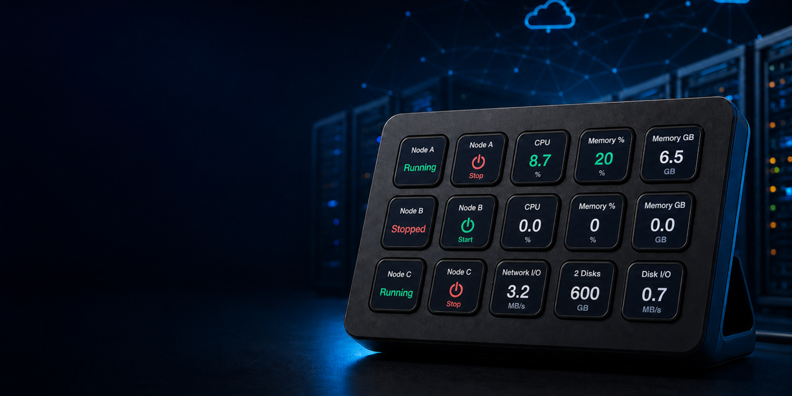
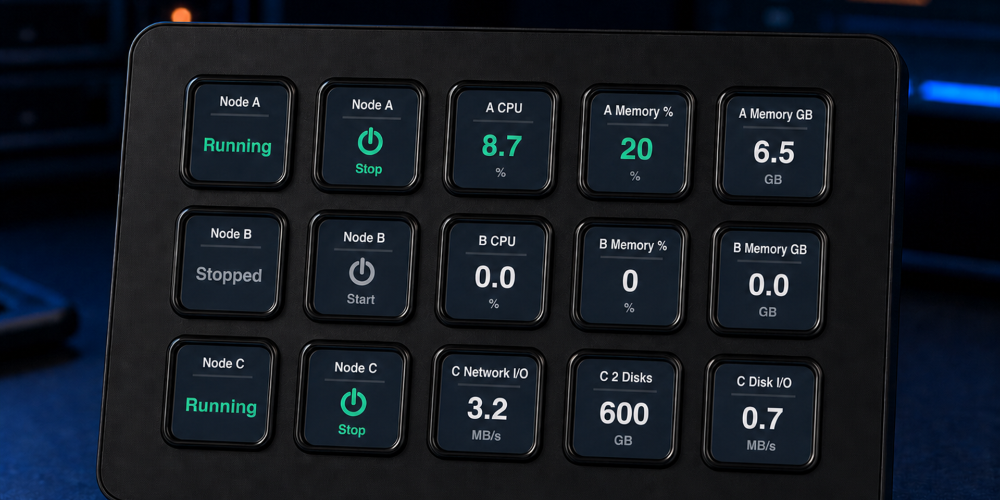
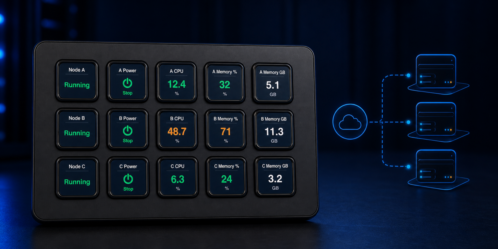
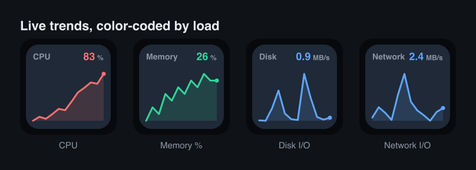
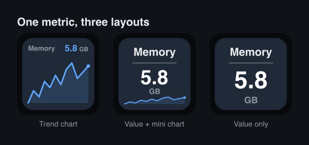

# OpenStack Monitor — Stream Deck Plugin

Monitor and control OpenStack instances right from your Stream Deck: **runtime status**, **resource usage**, and **power control**.
Built for OpenStack deployments that only allow Google SSO login, it uses an **Application Credential** to bypass SSO and call the API directly.

[](LICENSE)


<p align="center">
  
</p>

<p align="center">
  
  
</p>

<p align="center"><sub>Left: runtime status &amp; usage on a single key. Right: monitoring several instances at once.</sub></p>

## Table of Contents

- [Features](#features)
- [Installation](#installation)
- [Prerequisites](#prerequisites)
- [Configuration](#configuration)
- [Development](#development)
- [Architecture](#architecture)
- [License](#license)

## Features

| Action | Display | Short press | Long press (0.8s) |
|--------|---------|-------------|-------------------|
| **Instance Status** | Running / Shut off / Error… (color-coded by status) | Refresh | Open the Horizon detail page |
| **Instance Usage** | CPU% / Memory% / Memory / vCPU / Disk / Disk I/O / Network I/O — as a number or a trend chart | Refresh | Open the Horizon detail page |
| **Instance Power** | Power state (green / gray / orange) | Confirm the armed action — a plain tap only reminds you to hold | Arm: start a 5-second "tap to confirm" countdown (start / stop / reboot, configurable) |

Connection credentials are stored in the Stream Deck **global settings** and shared across all three button types. When monitoring multiple machines, each button only needs its own Instance ID — the credentials are entered once.

### Usage trends

Time-varying metrics can be drawn as a **sparkline** so you see the recent trend at a glance, not just the current value. The history comes straight from Gnocchi, so a key shows its full trend the moment you add it. CPU% and Memory% are tinted by load (green → yellow → red).

<p align="center">
  
</p>

Pick the layout per key in the Property Inspector's **Layout** dropdown — the same metric, three ways:

<p align="center">
  
</p>

The title deliberately omits the unit (`Memory`, not `Memory GB`) since the unit already shows on the key. Metrics whose value barely changes — Disk capacity and vCPU — always render as a plain number.

## Installation

**From a released build (recommended)**

1. Download `com.phantas-weng.openstack.streamDeckPlugin` from the [GitHub Releases](https://github.com/PhantasWeng/streamdeck-openstack/releases) page.
2. Double-click the downloaded file — Stream Deck installs the plugin automatically.
3. Add any of the three **OpenStack Monitor** actions to a key and configure it (see [Configuration](#configuration)).

**From source** — see [Development](#development) to build your own `.streamDeckPlugin` package.

> Requires the Stream Deck app **6.9+** on macOS 12+ or Windows 10+.

## Prerequisites

1. **The `application_credential` authentication method must be enabled in your OpenStack Keystone**
   (see [`docs/enable-application-credential.md`](docs/enable-application-credential.md)).
2. Create a credential in Horizon → Identity → Application Credentials, and note its `id` and `secret`.

> ⚠️ **Common pitfall**: the `clouds.yaml` downloaded from Horizon escapes any `&` in the secret as `&amp;`.
> Restore it back to `&` before use (for example, `4Y5*gD6&amp;vCK!` is actually `4Y5*gD6&vCK!`).

## Configuration

In the Property Inspector of any button, fill in the following (connection settings are shared across all three buttons):

- **Keystone URL**: e.g. `http://<keystone-host>:5000/v3`
- **Credential ID** / **Credential Secret**
- **Region**: e.g. `RegionOne` (may be left empty)
- **Instance ID**: the UUID of the target server
- **Dashboard URL**: used to open the detail page on long press, e.g. `https://<horizon-host>/dashboard` (leave empty to disable open-on-long-press)

For the **Instance Usage** button there are two extra per-key options: **Metric** (which value to show) and, for metrics that support a trend, **Layout** (`Trend chart` / `Value + mini chart` / `Value only`).

> If the API endpoint is on an internal network (e.g. `192.168.x.x`), the computer running Stream Deck must be on the same network (or connected via VPN).

## Development

```bash
yarn install
yarn verify      # Verify connectivity to OpenStack using the OS_* environment variables (see scripts/verify-openstack.mjs)
yarn icons       # Generate button icons
yarn watch       # Watch source changes, then automatically rebuild and restart the plugin
yarn build       # Package into a .streamDeckPlugin (output to releases/)
yarn test        # Run the unit tests (vitest)
yarn test:watch  # Run the unit tests in watch mode
yarn lint        # Biome check
yarn lint:fix    # Biome check with autofix
yarn bump        # Bump version + regenerate CHANGELOG (see scripts/bump.mjs)
```

### Connection Verification

```bash
OS_AUTH_URL='http://<keystone-host>:5000/v3' \
OS_APPLICATION_CREDENTIAL_ID='<id>' \
OS_APPLICATION_CREDENTIAL_SECRET='<secret>' \
OS_REGION_NAME='RegionOne' \
OS_SERVER_ID='<instance-uuid>' \
yarn verify
```

This runs the following checks in order: exchange for a token (bypassing SSO) → locate the Nova endpoint → query the instance status → check Gnocchi metrics.

## Architecture

```
src/
├── plugin.ts           # Register actions, listen for global settings changes
├── connection.ts       # Global connection-settings cache (populated via didReceiveGlobalSettings)
├── settings.ts         # Settings types and utilities (connection = global, target = per-action)
├── openstack.ts        # Keystone authentication (token caching) + Nova + Gnocchi clients
├── metrics.ts          # Display item catalog and calculations (CPU%, memory%, etc.)
├── rendering.ts        # Canvas rendering of button images
└── actions/instance.ts # The three actions + shared polling / long-press framework
```

- **Authentication**: Application Credential → Keystone token (cached, automatically refreshed before expiry).
- **Connection settings**: cached in `connection.ts` and updated only via the `didReceiveGlobalSettings` event — polling reads the cache synchronously to avoid a `getGlobalSettings()` feedback loop that would make the keys flicker.
- **Metrics**: sourced from Gnocchi. `cpu` is cumulative ns; utilization = `rate:mean` ÷ (granularity × vcpus × 1e9) × 100.

## License

Released under the [MIT License](LICENSE). © 2026 Phantas Weng.
